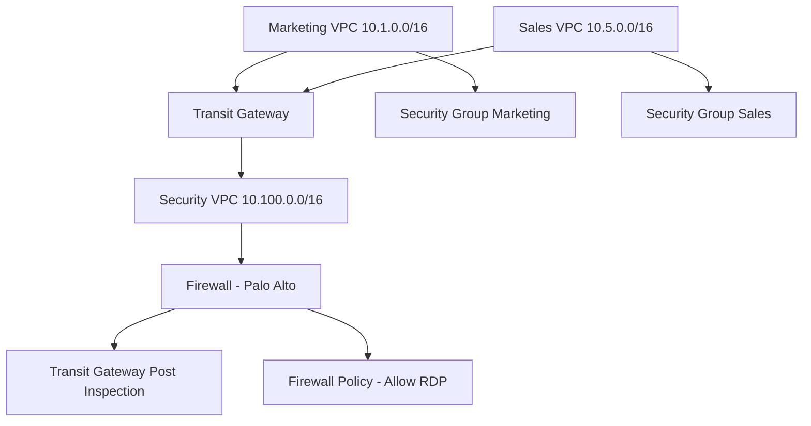

# AI Network Agent

This repository contains utilities and scripts for interacting with AWS and Palo Alto Networks, as well as an agent implementation for network automation tasks.

## Project Structure

- `agent.py` - Main agent logic for network automation.
- `aws_utils.py` - Utility functions for AWS integration.
- `palo_utils.py` - Utility functions for Palo Alto Networks integration.
- `requiments.txt` - Python dependencies for the project.

## Getting Started

### Prerequisites
- Python 3.10+
- pip (Python package manager)

### Installation
1. Clone the repository:
   ```bash
   git clone <repo-url>
   cd ai-network-agent
   ```
2. Install dependencies:
   ```bash
   pip install -r requiments.txt
   ```

### Adding Credentials with .env

This project uses a `.env` file to manage sensitive credentials (such as AWS keys or Palo Alto credentials). Create a `.env` file in the project root with the following format:

```
# Example .env file
AWS_ACCESS_KEY_ID=your_aws_access_key_id
AWS_SECRET_ACCESS_KEY=your_aws_secret_access_key
PA_VM_USERNAME=your_palo_username
PA_VM_PASSWORD=your_palo_password
OPENAI_API_KEY='openapi api key'
```

**Note:** Never commit your `.env` file to version control. Add `.env` to your `.gitignore` file if it is not already present.

### Usage
Run the main agent:
   ```bash
   python agent.py
   ```
Use utility modules (`aws_utils.py`, `palo_utils.py`) as libraries in your own scripts. 

## Cloud Architecture

The infrastructure used for this project was built in AWS using two application VPC's interconected by a Transit Gateway and one inspection VPC which contains a single Palo Alto VM.

`Terraform` was used to deploy the entire infrustructure and the link to the code will be added here soon.




## AI Usage

Below are example prompts and responses for using the AI agent to validate routing through cloud infrastructure and to check firewall/security policies:

### Example 1: Validate Routing Through Cloud Infrastructure

**Prompt:**
```
Can you verify if traffic from the Marketing VPC (10.1.0.0/16) can reach the Sales VPC (10.5.0.0/16) through the Transit Gateway?
```

**Response:**
```
Routing validation initiated...
✔️ Route tables in both Marketing and Sales VPCs have correct routes to the Transit Gateway.
✔️ Transit Gateway has attachments for both VPCs and propagates routes correctly.
✔️ No NACL or security group blocks detected for the relevant subnets.
Result: Traffic from Marketing VPC can reach Sales VPC via the Transit Gateway.
```

### Example 2: Validate Firewall Policies or Security Rules

**Prompt:**
```
Is RDP (TCP port 3389) traffic allowed from the Marketing VPC to the Sales VPC, and does the Palo Alto firewall permit this traffic?
```

**Response:**
```
Firewall policy validation initiated...
✔️ Security groups in both VPCs allow TCP/3389 between the relevant subnets.
✔️ Palo Alto firewall policy 'Allow RDP' is enabled and matches the source/destination.
✔️ No explicit deny rules found for this traffic.
Result: RDP traffic is permitted between Marketing and Sales VPCs through the firewall.
```


## License
MIT

## Author
- James Thom
